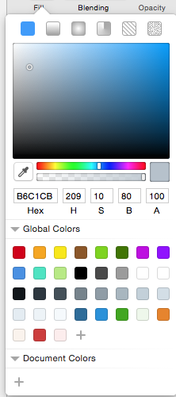

# My Sketch Colors
## mPATH Colors


This is the mPath color palette as a preset for the Sketch app (3.3 and higher).





# Installation

Copy and paste the following commands into Terminal and press return to run.


##### If you are using AppStore Version:
```
cd ~/Library/Containers/com.bohemiancoding.sketch3/Data/Library/Application\ Support/com.bohemiancoding.sketch3/
mv assets-v55.sketchpreset assets-v55.sketchpreset.backup
curl -O https://github.com/mpath-development/my-sketch-colors/raw/master/assets-v55.sketchpreset
echo "All Done! Now restart Sketch app."
```

##### If you are using Out of AppStore Version:
```
cd ~/Library/Application Support/com.bohemiancoding.sketch3/
mv assets-v55.sketchpreset assets-v55.sketchpreset.backup
curl -O https://github.com/mpath-development/my-sketch-colors/raw/master/assets-v55.sketchpreset
echo "All Done! Now restart Sketch app."
```
You can also [restore your colors](https://github.com/danieljacobarcher/my-sketch-colors/wiki/Restore-your-colors) if you regret it.


